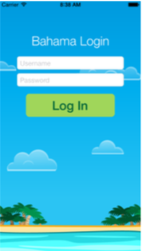
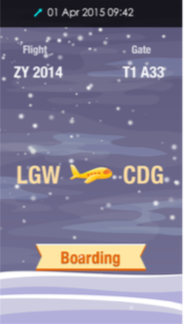

# 第一部分：View动画

最开始的五个篇章将会向你介绍使用UIKit的API来实现动画效果。这些API经过特别设计使得你不用考虑Core Animation的复杂性，就可以很容易的让你的view产生其提供的动画效果。

尽管UIKit的动画API很容易使用，但是他也不失灵活性和强大的动画功能，从而可以满足你对动画的需要。

动画可以用在可见的、带有银幕效果的View或者是你的界面上的其他可见对象:

因此，你可以让所有最终继承与UIView的对象动起来；包括有UILabel, UIImageView, UIButton或者其他你自己实现的继承与UIView的对象。

在这部分的五个关于View动画的章节中，将会教会你如何用动画装饰一个虚构的航空App ： “Bahama Air”。为了给UI组件添加各种动画，首先我们从登陆界面开始增加动画效果：

在下面的这几章，我们主要实现这些效果：

* *第一章：View动画初体验*：你将学会怎么移动、缩放、淡入View.通过创建各种不同的动画来熟悉Swift和基本的UIKit API。

* *第二章：弹簧效果*：你将学会线性动画并创建更吸引眼球的的弹簧驱动（spring-driven）的动画。

* *第三者：转场过渡效果* 你将学会UIKit里面一些让View从屏幕中出现和消失的动画的类方法。这些单行API非常容易的可以实现转场效果。

当你完成了登录界面的工作后，就可以开始做"Bahama Air"的飞行状态界面了。在此之前需要添加动画效果让登录界面退出的效果变得更精彩：

首先你需要在屏幕完成一个静态界面，然后增加一系列的精彩的、高级动画来提高用户体验。

* *第四章：实战View动画* ：你将学会使用UIKit 动画的必要知识。这章将通过组合你已经熟悉的动画教会你如何创造精彩的动画
* *第五章：关键帧动画* ： 你将使用关键帧动画解锁最终精彩的动画效果：通过组合一组不同的界面创建一个精美的动画效果。

当你完成了这部分所有章节的学习后，你将获得学习余下内容的动画效果经验。

这部分展示了为你的view添加动画效果是多么的简单，所以让我们从第一章开始吧。

