# 第三章：转场效果
通过前面的两章两章的学习，你已经学会如何使用view的属性如位置、透明度等进行动画播放。但是对于view的进出动画要怎么做呢？

使用之前章节中用的将view移入或者移除用户视野是一个可行的方法。然后本章将会教授另一种改变view呈现状态的动画方法：转场动画。

转场效果是一种view的预定义动画，这些预定义动画不会在view开始到结束中间产生效果，相反的，他只会影响view出现时的效果。

## 转场示例
为了更好的理解何时该使用转场动画，这一小节会先带你领略各种使用转场动画的场景。

###添加一个新的View

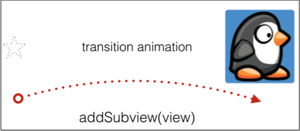

通过调用和之前章节类似的API，可以为屏幕上新出现的view增加动画，不同的时，这次需要制定一个名为"animation container view"转场动画效果.

这个转场动画将作用在容器View和其容纳的所有子View上，请看如下代码片段：

	var animationContainerView: UIView?
	override func viewDidLoad() {
		//set up the animation container 
		animationContainerView = UIView(frame: view.bounds) 		animationContainerView!.frame = view.bounds view.addSubview(animationContainerView!)
	}
	override func viewDidAppear(animated: Bool) {
		super.viewDidAppear(animated)

		//create new view
		let newView = UIImageView(image: UIImage(named: "banner")!) newView.center = animationContainerView!.center
	
		//add the new view via transition
		UIView.transitionWithView(animationContainerView!, 
			duration: 0.33,
			options: [.CurveEaseOut, .TransitionFlipFromBottom], animations: {
				self.animationContainerView!.addSubview(newView) 

		}, completion: nil)
	}

这里假设应用中有这样的一个场景，在你的应用的"View Controller"里面“viewDidLoad()”里面创建一个名叫“animationContainerView"的View，然后将这个view添加到界面中并做好定位。

然后，现在你需要再创建一个带有转场效果的新View，假设是新View为“newView”。


通过调用`transitionWithView(_:duration: options:animations:completion:)`创建转场动画，这里创建的代码于UIView中的标准动画几乎完全一致，所不同的就是新增了一个"view"参数，用来表示转场动画的容器View。


这里还用到了一个没有用过的动画选项：.TransitionFlipFromBottom ，它和前面篇章中介绍的动画选项一样是一个预定义的值。".TransitionFlipFromBottom"使得view从屏幕的底部飞出来，就想从一扇门中飞出来时的那个门一样。

最后，在动画的block中为容器View添加上要新增的子View，从而使其按照预定的动画效果出现。


这里罗列了所有的转场动画的效果：

	.TransitionFlipFromLeft 
	.TransitionFlipFromRight 
	.TransitionCurlUp 
	.TransitionCurlDown 
	.TransitionCrossDissolve 
	.TransitionFlipFromTop 
	.TransitionFlipFromBottom

###删除一个view

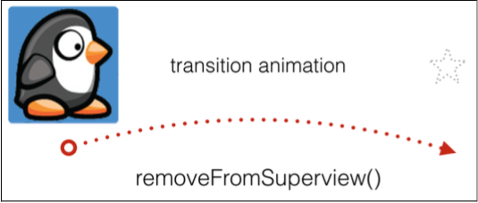

为从屏幕中移除一个View添加动画效果和上面的新增一个View的动画效果是类似的。只要将动画效果block里面的函数改成`removeFromSuperview()`就可以了，如：

	//remove the view via transition
	UIView.transitionWithView(animationContainerView!, 

		duration: 0.33,
		options: [.CurveEaseOut, .TransitionFlipFromBottom], animations: {
			self.newView.removeFromSuperview() 

		}, 

		completion: nil)
和前面的例子一样，闭包中的转场动画效果将会作用在“newView”的退出时。

###隐藏或者展现一个view

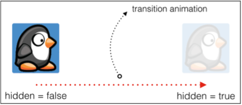

到目前为止，你所学的转场动画还只局限在改变view的层级关系上，这也是为什么总是需要一个容器view来表示层级关系。

现在我们来看一个不需要用容器view方式来隐藏和展现一个view。此时，带有转场动画效果的view用其自身作为容器。

下面的代码展示了怎样给隐藏一个子view添加转场动画：

	//hide the view via transition
	UIView.transitionWithView(self.newView, duration: 0.33, options: 
	[.CurveEaseOut, .TransitionFlipFromBottom], animations: {
	
		self.newView.hidden = true 

	}, completion: nil)
		

这里给`transitionWithView(_:duration:options:animations: completion:)`传递的第一个参数表示需要隐藏或者呈现的view。接着只要在动画block里面设置view的"hide"属性即可。

###用一个view替换另一个view

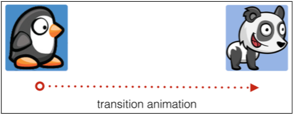

用一个view替换另一个view的操作也非常简单。只要在第一个参数中传递要被替换的view，然后将替换的view传给"toView:" ，如下代码：

	//replace via transition
	UIView.transitionFromView(self.oldView!, toView: self.newView!, 
	duration: 0.33, options: [.TransitionFlipFromTop],
	completion: nil)

由此可见强大的UIKit可以带来多么丰富的效果。

在本章中，你学会了一些新的动画效果，比如实践了如何为呈现或者隐藏view添加转场动画。


##组合转场效果
现在让我们接着完成“Bahama Air”项目的登录界面。之前我们已经为登录界面创建了一系列的动画了，包括登录表单的跳动、登录按钮按下的效果等。

下面，我们将模拟一些用户鉴权并动态的呈现一些进度信息。当用户点击登录按钮的时候，根据情况依次展示“Connection”，“Authorizing”以及“Failed”。

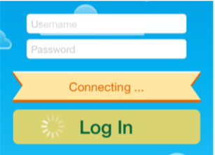

如果还没有学习完前面的章节，可以从本章的资源文件家中的开始工程（译者注：BahamaAir-Starter目录）。如果你依次完成了前面章节中的练习题，那么恭喜你，可以在你的工程上继续。

打开" ViewController.swift"可以看到“viewDidLoad()”里面的增加了一个类成员变量`status`来保存要隐藏的图片view,接着的代码创建了一个Label兵将其作为子view加载到`status`上。这里将用`status`想用户展示进度信息。要展示的消息存在类成员变量消息数组`messages`中。

在ViewController中添加如下代码：

	func showMessage(index index: Int) { 
		label.text = messages[index]
		
		UIView.transitionWithView(status, duration: 0.33, options: 
		[.CurveEaseOut, .TransitionCurlDown], animations: {
			self.status.hidden = false 
		}, completion: {_ in
			//transition completion
		})
	}

这个函数一个`index`参数，通过`index`来决定显示在label上的消息内容。

接下来在要添加动画效果的view上调用`transitionWithView(_:duration:options:animations: completion:)`。在动画block里面设置`hidden`为`false`可以以转场动画效果显示标语。


在上面的代码中添加了一个新的动画选项 `.TransitionCurlDown`。这个动画选项的效果是使view就像一摞纸落在地上时效果，效果如下：



现在就可以在适当的地方调用上面的`showMessage(index:)`方法了。找到`login()`里面的block:

	animations: { 
		self.loginButton.bounds.size.width += 80.0
	}, completion: nil)

	
这个block是在用户点击登录按钮的时候，让登录按钮弹出来的动画效果的blcok。现在需要在这个闭包中增加一个新的动画闭包，也就是这里的`showMessage(index:)`。

将completion参数从nil改变成如下的函数闭包：


	completion: {_ in 
		self.showMessage(index: 0)
	}

这里的闭包接受一个Boolean类型参数，用于标示动画是否是成功执行完之后的的退出了还是中途被取消了而退出。在上面的例子中，我们并不关心动画是否被执行完成了，所以传递一个"_"参数，从而忽略其值。

在上面的闭包中，通过传递0给`showMessage`来显示消息数组中的第一个元素。

构建并运行工程，点击登录按钮，这里会看到状态标语里面会显示第一个阶段中的消息：

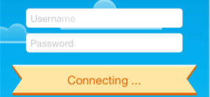

这里你注意到标语是如何向一摞纸一样卷曲下来的么？这通常是让用户注意到一段静态文字的好方法。

> 注意： 有些动画让人觉得太快了，是不是？有时候需要在一个特定的地方按照一定的顺序显示一个动画，或者仅仅是想动画播的满一点，从而可以好好观察动画的播放过程。
>
> 在iPhone模拟其中选择“Debug“-》”Toggle Slow Animations in Frontmost App ”,可以让动画的播放过程慢下来。现在再来看看登录等会是如何展现的。

为了继续下一个动画，，这里首先要保存下标语的初始化位置，这样可以让下一个动画从同样的位置开始播放。

在"ViewController"类中添加如下属性:

	var statusPosition = CGPoint.zero

然后将下面保存标语初始位置的代码添加到`viewDidLoad()`中：

	statusPosition = status.center
	
现在就可以开始设计一系列的视图动画和转场动画的组合效果了。

将下面的通过标准动画从屏幕上移除状态消息的代码添加上：

	func removeMessage(index index: Int) {
		UIView.animateWithDuration(0.33, delay: 0.0, options: [], animations:{
			self.status.center.x += self.view.frame.size.width
		}, completion: {_ in
			self.status.hidden = true self.status.center = self.statusPosition
			elf.showMessage(index: index+1) })
	}

上面的代码，我们看到了之前的老朋友`animateWithDuration(_:delay:options:animations:completion:) `,用来将`status`从屏幕中移动到不可见的区域。

当`completion`闭包中的动画执行完了之后，将`status`移回到它初始的位置，并将其掩藏不可见，最后再调用`showMessage`并传入下一个提示语的下标。

将标准动画和转场动画组合是非常简单的：只需要调用适当的API，UIKit的中对应的"Core Animation"动画的部分就会在后台帮你实现动画逻辑。

接下来，还需要你用"showMessage"和“removeMessage”完成消息通知链中的其他几条消息的显示，从而模拟一个完整的鉴权过程。

找到`showMessage(index:)`并将其中的注释`//transition completion`替换成下面的代码：

	delay(seconds: 2.0) {
		if index < self.messages.count-1 {
			self.removeMessage(index: index) 
		} else {
		//reset form
		} 
	}

这样在转场动画完成以后，再等待2.0秒，然后检查是否还有未显示的消息。如果有就调用`removeMessage(index:)` 移除当前消息，接着在`removeMessage(index:)`的完成block中调用`showMessage(index:)`展示新的消息。

> 注意：函数 `delay(seconds:completion:)` 定义在"ViewController.swift"的开始的地方，用于在延迟一段时间后运行一个block代码。这里我们主要用它来模拟网络上的延迟。

再次构建并运行你的工程；感受下依次出现的更新认证进度消息的动画：

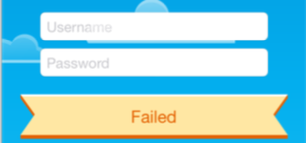

转场动画是UIKit中唯一可以创建出3D动画效果的工具，所以虽然转场动画很简单但是确实你动画素材工具箱中的重要组成部分。

如果想进一步学习更多的3D效果，可以先去查看第四部分的"3D动画"，这一部分将会详细介绍Core Animation和3D 层面的转场动画。

在进行下一章节的学习之前，请先完成本章的练习题。因为前面已经学习了三章动画相关的内容，这里一个练习肯定满足不了你的好奇心，所以我们准备了三道练习：

## 练习

### 练习一： 选择你最喜欢的转场动画

到目前为止，你只看到了一种转场动画效果，还想了解其他的转场动画效果么？

在这个练习中，你可以尝试所有其他可用的转场动画效果，并选择你最喜欢的效果来展现进度条的标语信息。

打开“ViewController.swift”文件然后找到"showMessage(index:)"函数中指定动画效果的".TransitionCurlDown":
	
	UIView.transitionWithView(status, duration: 0.33, options: [.CurveEaseOut, .TransitionCurlDown], animations
	
将`.TransitionCurlDown`替换成下面列表中的其他转场动画效果，然后构建并运行你的工程观察各自的效果到底是怎样的：

	.TransitionFlipFromLeft 
	.TransitionFlipFromRight 
	.TransitionCurlUp 
	.TransitionCurlDown 
	.TransitionCrossDissolve 
	.TransitionFlipFromTop 
	.TransitionFlipFromBottom
哪一种效果在屏幕上面表现更好呢？

加入你还很难抉择，靠椅考虑我最喜欢的效果`.TransitionFlipFromBottom`。我觉得他用于标语最适合不过了。

	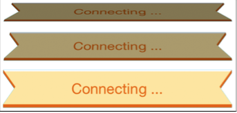

### 练习二： 将表单重置成其原始状态
这个练习目的是要重置所有按过登录按钮后的动画效果，并将表单还原成其初始的状态。这样，当用户登录失败会，再次点击登录按钮后，又能看到和之前一样的动画效果。

可以参考这里列出来的步骤：

1. 创建一个空的"resetForm"函数，并在上面的代码中的注释“//reset”位置调用这个函数。
2. 在"resetForm"函数中使用`transitionWithView(_:duration:options: animations:completion:)`设置"status"为不可见并居中在"self.statusPosition"。可以给0.2秒的动画持续时间，将"status"还原到了其初始位置。
3. 通过使用和显示标语相反动作的动画来掩藏标语，可以使得动画看起来更自然。比如用`.TransitionCurlDown`显示的就用`.TransitionCurlUp`来隐藏。
再比如`.TransitionFlipFromBottom`的反义词是`.TransitionFlipFromTop`
4. 下一步，在"restForm()"里面添加`animateWithDuration(_:delay:options: animations:completion:)`的调用，并将如下列表中的动作加入到完成时的闭包中：
  a. 移动self.spinner: 将登陆按钮中的提示移动到他的初始位置(-20.0, 16.0)
  b. 将self.spinner的alpha值设置为0.0，从而使其不可见
  c. 将登陆按钮的背景色调整成其原始的颜色`UIColor(red: 0.63, green: 0.84, blue: 0.35, alpha: 1.0)`
  d. 继续讲登陆按钮的改变还原成原来的样子，并将`bounds.size.width`设置成80.0
  e. 最后，将按钮向上移动到密码输入框下方原来的位置，也就是将 center.y 设置成60.0
  
如果你对进度条标语完成了所有复原动画，屏幕将会如下显示：

	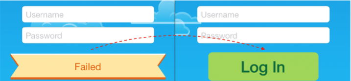
	
好了，我们准备来看终极联系：
	
	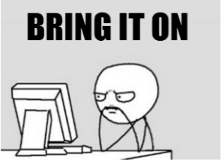
	
###终极练习

设想一下，加入那些背景里面的小云朵缓慢的从屏幕的一侧移动到另一侧，在移动回来，会不会很酷呢？

毫无疑问，效果肯定酷毙了，让我们来完成这个酷毙了的练习。

这四片云朵已经被当成outlets连接到“ViewController”了，所以我们从这里开始。你可以自行发挥想象，来移动云朵，也可以参照如下步骤：

1. 创建一个新的函数`animateCloud(cloud: UIImageView)`并将移动云朵的代码加入其中。
2. 计算云朵移动的速度，这里假设云朵花费60.0s从屏幕一侧移动到另一侧，那么速度cloudSpeed变量就是` view.frame.size.width/60.0 `(译者注：原文是60.0 / view.frame.size.width 应该算反了)。
3. 下一步，计算云朵移动到右侧所花费的时间。由于云朵并不一定是出现在屏幕左边的，所以需要用云朵距离屏幕右侧的距离和移动的速度来计算出其需要的时间：`(view.frame.size.width - cloud.frame.origin.x) * cloudSpeed`
4. 然后用计算出来的时间调用`animateWithDuration(_:delay:options:animation: completion:)`。这里需要用“NSTimeInterval”来创建一个时间变量：`NSTimeInterval(duration)`。"optons"参数使用".CurveLinear"，前面章节中学习的让动画匀速运行的效果。云朵自然的在背景中运行，看上去应该是匀速的变动。
5. 在动画的闭包表达式中，将"frame.origin.x "设置成“self.view.frame.size.width”从而将云朵移动到屏幕视线外面。
6. 在动画的完成闭包中，通过设置“frame.origin.x ”为"-cloud.frame.size.width",将云朵移动到其方向的屏幕的外面，别忘啦用"_"忽略闭包中的不需要使用的参数。
7. 还是在动画完成的闭包里面，调用"animateCloud()"从而使得云朵再次播放动画。
8. 最后，将下面的代码添加到“viewDidAppear()”从而启动云朵上的动画效果。

	animateCloud(cloud1) 
	animateCloud(cloud2) 
	animateCloud(cloud3) 
	animateCloud(cloud4)
	
这个将使得四朵云朵慢慢的移动，从而创建一个动感的画面。

如果你完成了这之前的所有动画，那么恭喜你。

虽然这几章的文字说的非常复杂，但是通这样的过程，你将一个静态登陆表单变成了一个动感十足的登陆界面展现给用户。

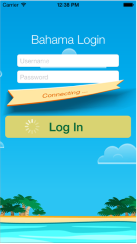

是时候将之前所学的所有动画素材归总一下并进行测试了！下一章，你讲组合你所学的所有知识，来给"Bahama Air"应用进行润色。

		