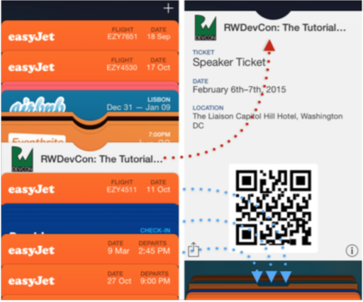

# 简介

毫无疑问，创建动画效果是iOS开发中最有乐趣的部分之一。

创建动画是很有趣的，动画能给你的用户界面带来生机，更重要的是，动画可以让你的用户界面使用起来更有兴致。试想，谁不喜欢一个在打开一个菜单或者点击按钮时能展现出一点视觉震撼效果的App呢？

你可能已经看过一些第三方App里面令人印象深刻的动画效果，比如Apple自家内嵌的应用 Passbook(译者注：国内Appstore上面搜不到Passbook但是有个类似的App叫“Wallet”)：

使用切当的动画不仅能够精准的传递信息给你的用户，而且可以将用户的视野移动到界面上重要的部位。为了创建引人注目的用户界面，你需要组合各种动画效果，无论是细小的动画还是跨屏幕极为传神的动画。

本书将教会你各种使用各种iOS动画技术，包括了简单动画、3D动画甚至是让导航生动的View Controller动画。

读完本书后，你已经实践了各章节的动画技巧内容，并且能够很好的解决书中留下的习题。这样就可以将这些动画效果
运用到你自己的App中去。

## 前提条件
为了能够实践书中的教程，你需要下面几样工具：
* *一台装有OS X Yosemite（10.10.5）以上版本或者EI Capitan(10.11)的Mac设备。* 从而可以安装最新版本的Xcode。
* *Xcode 7 或以上版本。* Xcode是开发iOS App的主要工具，可以在[https://itunes.apple.com/app/xcode/id497799835?mt=12](https://itunes.apple.com/app/xcode/id497799835?mt=12)这里下载。
* *Swift和iOS开发的基础知识。* 本书主要是讲解动画效果的，为了能够运行书中的Demo中从而理解动画效果的代码，你需要最基本Swift和Cocoa Touch。

如果想在真机上面进行调试，那还需要购买Apple的开发者账号。书中的所有例子都可以在模拟器上正常运行，所以要不要购买Apple开发者账号，不是必要的。

## 目标读者 

本书的目标读者是已经有Swift和iOS开发基本知识并希望深入学习iOS动画开发的开发者。

如果你还不会iOS基本开发技术，建议先阅读最新版本的《The iOS Apprentice》（译者注：这是[Ray Wenderlich](https://www.raywenderlich.com/) iOS初学教程),这本书会教会初学者用Swift构建iOS App基本知识。

如果你已经回iOS基本开发技术，但是还不会Swift，建议阅读最新版的《Swift Apprentice》译者注：这是[Ray Wenderlich](https://www.raywenderlich.com/) Swift初学教程)，这本书通过playgournds演示教学教会你Swift语音的各种特性。这些书都可以在[http://www.raywenderlich.com/store](http://www.raywenderlich.com/store)这里进行购买。

## 怎样使用本书
书中的每章都包含一个包含了该章中介绍的动画效果的demo工程，从而使你可以任意的选择章节进行阅读。

然后，对于初学者，我们建议还是按照顺序进行学习，因为部分章节还是建立在前者的基础之上。同时，记住除了书本内容，文中的教程和文后的练习题也可以让你获得书中之外的知识。

对于高级开发者，由于你可能对这些动画效果的Swift接口API不是很熟悉，所以阅读前面的一些篇章也是值得的。当然，如果你已经熟悉了这些API，也可以直接跳跃到后面你感兴趣的章节进行也额阅读。

## 本书结构

### 第一部分： View动画

### 第二部分： 自动布局

### 第三部分： Layer动画

### 第四部分： 3D 动画

### 第五部分： 其他类型动画

### 第六部分： View Controller 动画

### 第七部分： 第三方动画库

## 源码和论坛
本书的每一章都有对应的完整代码示例，有些章节还包括了教学工程和其他需要的资源--随PDF一起发布。这些你都可以在阅读时同步学习。 

除此之外，我们还建立了一个官方论坛[http://www.raywenderlich.com/forums](http://www.raywenderlich.com/forums),在这里你可以问书中的问题、在开发你自己的动画时获得反馈或者提出一些错误或者建议。

