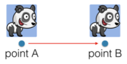
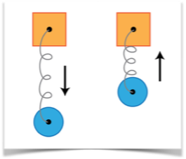
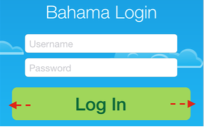
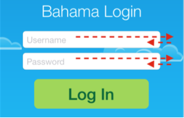

# 第二章：弹簧效果
在之前的章节中，你已经学会用UIKit创建基本的动画效果。比如设置一个起始和结束属性值，UIKit就可以自动的为你添加上动画效果。

到目前为止，你的动画还都只局限于单向的移动，从位置A径直移动到位置B，如图所示：

本章，你讲学会如何创建一种类似接在弹簧上面的复杂动画效果，效果如下图：

如果在从A点移动到B点的基本动画的基础上增加一些弹簧效果，使得动效如果下图中红色箭头指示的一样：

效果中，View从A点径直移动到B点，但是到达B点后却并没有停下来，而是越过去了，然后又回弹，接着又超过B点，反复几次后最终停在B点。

这个是个非常靓的效果，他为你的动画增加了生动的现实生活中的效果，本章将会向你展示如何用这些效果来装饰你的UI。

## 弹簧动画
我们还是从前一章中的例子工程开始，如果你还没有完成第一章中的习题（包括最后的挑战题目），也可以使用资源文件夹中的第二章的开始（译者注：BahamaAir-Starter目录）工程开始学习。

构建并运行，你将看到下面的截图（除了登录按钮）中动画的显示一样：

请将注意力放在最后一个没有添加动画的元素上：登录按钮。

打开“ ViewController.swift”文件，然后在`viewWillAppear()`添加如下两行代码：

	loginButton.center.y += 30.0 
	loginButton.alpha = 0.0
	
就和在之前一章做的一样，想将按钮的起始位置的纵坐标设置的低一点，然后将其alpha值设置为0，从而在一开始的时候不可见。

然后在`viewDidAppear()`里面添加如下代码：

	UIView.animateWithDuration(0.5, delay: 0.5, 
	usingSpringWithDamping: 0.5, initialSpringVelocity: 0.0, 
	options: [], animations: {
		self.loginButton.center.y -= 30.0
		self.loginButton.alpha = 1.0 
	
	}, completion: nil)

注意这段代码中的两个点：


首先，显而易见的这里一下为两个属性添加了动画效果；其次这里用来一个特别长的添加动画的方法 `animateWithDuration(_:delay:usingSpringWithDamping:initialSpringVelocity:opti ons:animations:completion:)`
.

上面的方法和之前用的方法十分类似，但是增加了几个带有运动效果的参数：

* usingSpringWithDamping: 这个参数控制了到达最终状态时的阻尼或者缩小量，也就是震动的最大幅度。参数范围是0.0到1.0，0.0弹的幅度最大，1.0就和没有弹簧的效果一样，所以可以把这个参数看做是弹簧的“刚性”。
* initialSpringVelocity: 这个参数控制弹簧的初始速度。1.0 表示动画所有长度每秒。不同大小的值会使弹簧有不同的速度。

构建并运行工程，观察现在按钮如何移动：

由于上面讲动画的初始速度设置为0.0，以及阻尼设置成0.5，所以动画效果看起来并不是特别好。

通过调整上面的速度和阻尼参数，可以调整动画的效果，使得更生动些。

将动画持续时间改成3.0，让后将阻尼设置成0.1，通过这样非正常的速度可以仔细的观察动画的执行过程。

构建并运行工程；观察按钮在其向上移动过程中的透明度变化。由于弹簧动画效果会影响所有的动画属性，所以根据上面代码所示，会同事改变按钮的高度和alpha值。

现在再将initialSpringVelocity改成1.0然后构建并运行工程：

这里，会看到登录按钮动画的时候会弹的超出密码输入框一些；这是因为更大的初始速度会使得其他开始的时候获得更大的动能，所以会造成其在到达最终位置的时候，移动的距离更长。

多去调整速度和阻尼参数，让后运行并观察效果，直到了解通过修改这些参数会对动画效果有怎样的影响。最后，将他们设置成最开始的值，如下：

	UIView.animateWithDuration(0.5, delay: 0.5, usingSpringWithDamping: 0.5, initialSpringVelocity: 0.0, options: [], animations: {
	
		self.loginButton.center.y -= 30.0
		self.loginButton.alpha = 1.0 

	}, completion: nil)

	

## 为用户交互增加动画

弹簧效果不仅限于在设置元素初始位置的时候，也可以用来响应用户的输入从而使得用户交互更生动。这一小节将会为用户点击添加响应动画。


在`login()`里面添加如下代码：


	UIView.animateWithDuration(1.5, delay: 0.0, usingSpringWithDamping: 0.2, initialSpringVelocity: 0.0, options: [], animations: {

	self.loginButton.bounds.size.width += 80.0 

	}, completion: nil)

上面的动画效果在1.5秒内将按钮的宽度增加了80点（译者注：和像素分开，不同屏幕上点到像素换算关系不一样）。由于阻尼仅设置了0.2，按钮的左右边变宽在变宽的过程会只超过一点点。

构建并运行工程，然后点击按钮来观察动画的表现：

在点击的时候，按钮首先会变大，并且左右边会弹一下。这个效果可以用来提示用户按钮已经被点击了。

接着，让我们来组合一些其他的弹簧动画，让按钮的效果更生动一些。

将如下代码添加到`login()`中：

	UIView.animateWithDuration(0.33, delay: 0.0, usingSpringWithDamping: 0.7, initialSpringVelocity: 0.0, options: [], animations: {
		self.loginButton.center.y += 60.0 

	}, completion: nil)

上面的动画在按钮被按下时将把按钮向下移动60点，注意观察动画持续时间比增加宽度的动画要少的多。


这个减少是有意的，从而使得整个动画的效果是先从原来被按下的位置移动到一个新的位置，然后再开始变宽。


构建并运行，然后观察现在按下按钮时动画是如何表现的：



是不是看起来很酷，但是即将变成动画大师的你，是不是觉得还可以更酷一点！


另一种用于相应用户按下按钮效果的方式是改变颜色，在用户按下按钮的时候，通过改变按钮的backgroundColor属性。

将如下代码加入到动画效果的闭包里面：

	self.loginButton.backgroundColor =
		UIColor(red: 0.85, green: 0.83, blue: 0.45, alpha: 1.0)

		

构建并运行工程，现在点击按钮，将看到按钮首先移动位置，然后再变形，紧接着改变颜色：



最后我们再来添加一个按下按钮的相应：一个动态提示。登录按钮将会触发一个经过网络的用户验证过程，所以此时最好添加一个动态提示，用户暗示用户
没有卡死，现在正在运行。


向上看到`viewDidLoad() `里面的代码，找到包含一个UIActivityIndicatorView的进度条.spinner的退出代码，现在由于将其alpha设置成了0，所以其不可见。


回到`login()`的代码中，将下面的代码添加到动画闭包中：


	self.spinner.center = CGPoint(x: 40.0,
		y: self.loginButton.frame.size.height/2)
	self.spinner.alpha = 1.0

上面的动画将进度条移动到左边，并进行淡出显示。这样就能提示用户，现在正在处理其登录请求。


构建并运行工程，注意观察这个终极版本中新增的内容：


现在来回想下，到现在为止做了什么？--为按钮总共增加了三个动画效果：让按钮变宽，修改按钮的为止以及改变按钮的颜色。


除此之外还用淡入效果显示了一个作为按钮的子View动态进度提示。


所有的效果都是通过UIKit来组合，从而展示了一个无缝衔接的效果。

现在不用关系这些动画的实现细节，把注意力放在如何通过UIKit来实现取悦用户的效果。


##习题
##习题一：将文本输入框动画改成弹簧动画
UIKit中的弹簧动画效果API在使用上和其他标准动画的几乎一模一样。所以现在你应该可以非常容易的将"username"和“password”输入框修改成弹簧动画效果。

完成这个联系，你需要：
1. 为“username”输入框增加`usingSpringWithDamping`和`initialSpringVelocity`参数，先试试0.0的初始速度以及0.2、0.6或者0.9的阻尼值，运行观察效果，然后选择一个最好看的参数值。
2. 同样将上面修改用在“password”上面。

此刻，你已经获得了使用弹簧动画的技巧。通过不断尝试弹簧动画，不断的修改速度和阻尼参数配合产生的效果，可以为你以后再设计App时提供更多的动画素材。

现在准备好了下一章了么？在第三章中，你讲学另一种UIKit的动画效果：[转场动画](./chapter_3_transitions.md)

